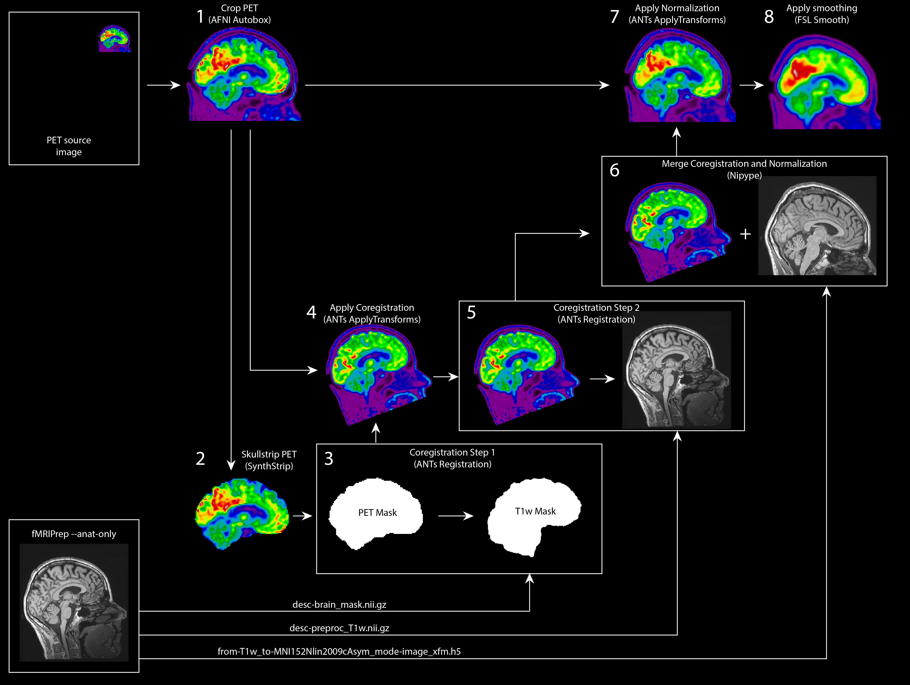

# PET Brain Preprocessing
Robust Nipype workflow for preprocessing PET BIDS brain data. Initially developed for 18F FDG PET brain images acquired by project NEMO at the Department of Neurology, University Medical Center Groningen. https://www.movementdisordersgroningen.com/nl/nemo. This workflow was also successfully tested on 18F FEOBV PET brain images.

# About
Since existing preprocessing pipelines for FDG PET brain data may require many manual correctons, we set up this a preprocessing pipeline for PET Brain Preprocessing. This preprocessing pipeline is currently built for static PET brain images stored in [BIDS format](https://bids-specification.readthedocs.io/en/stable/04-modality-specific-files/09-positron-emission-tomography.html). The goal of the pipeline was for it to be robust, easy-to-use, and minimal. 

Minimal preprocessing includes (1) _coregistration_ and (2) _normalization_ of PET brain images. This pipeline complements `--anat-only` preprocessing of T1w anatomical images by [fMRIPrep](https://fmriprep.org/en/stable/).



# Requirements
- [fMRIPrep](https://fmriprep.org/en/stable/)
- [FSL 6.0](https://fsl.fmrib.ox.ac.uk/fsl/fslwiki/FslInstallation)
- [AFNI 21.3.04 'Trajan'](https://afni.nimh.nih.gov/pub/dist/doc/htmldoc/index.html)
- [ANTs 2.3.5](http://stnava.github.io/ANTs/)
- [Synthstrip-docker](https://surfer.nmr.mgh.harvard.edu/docs/synthstrip/). Also see [(Hoopes, et al., 2022)](https://doi.org/10.1016/j.neuroimage.2022.119474).

# Running the pipeline
```
$ pip install git+https://github.com/jrdalenberg/PETBrainPreprocessing.git
$ pet_brain_preprocessing -h

usage: pet_brain_preprocessing [-h] --participant-label PARTICIPANT_LABEL [--nprocs NPROCS] [--fwhm FWHM] [--work-dir WORK_DIR] bids_dir output_dir anat_derivatives_dir

Function that handles the inputs for preprocessing pet images.

positional arguments:
  bids_dir              Path to the BIDS dataset directory.
  output_dir            Output directory.
  anat_derivatives_dir  fMRIPrep Anatomical derivatives directory.

optional arguments:
  -h, --help            show this help message and exit
  --participant-label PARTICIPANT_LABEL
                        A space delimited list of participant identifiers or a single identifier (the sub- prefix can be removed).
  --nprocs NPROCS       Maximum number of threads across all processes.
  --fwhm FWHM           The full width at half maximum smoothing kernel.
  --work-dir WORK_DIR   Path where intermediate results should be stored.

```

# TODO
- Make outputs BIDS compatible.
- Make participant label optional.
- Make docker image.
- Add support for dynamic scans.
- Add motion correction for dynamic scans.
- Add pharmakinetic modeling for dynamic scans.
- Add optional atlas-based segmentation.
- Add optional small volume correction.

# License information
## License
Copyright (c) 2023, the PET Brain preprocessing developers.

PET Brain preprocessing is licensed under the Apache License, Version 2.0 (the "License"); you may not use this file except in compliance with the License. You may obtain a copy of the License at http://www.apache.org/licenses/LICENSE-2.0.

Unless required by applicable law or agreed to in writing, software distributed under the License is distributed on an "AS IS" BASIS, WITHOUT WARRANTIES OR CONDITIONS OF ANY KIND, either express or implied. See the License for the specific language governing permissions and limitations under the License.

# Acknowledgements
This work was supported by ZonMw TOP 2019.